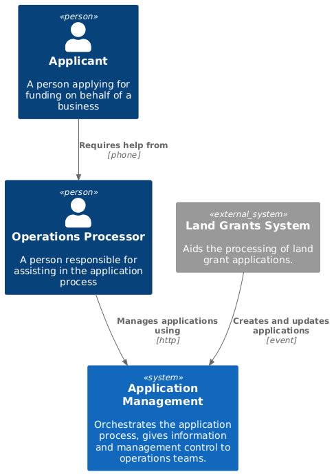

# Application management system

Orchestrates the application process, gives information and management control to operations teams.

## Context diagram

## Capabilities

### Control application process flow

### Exception managment

### Provide complete view of application state
