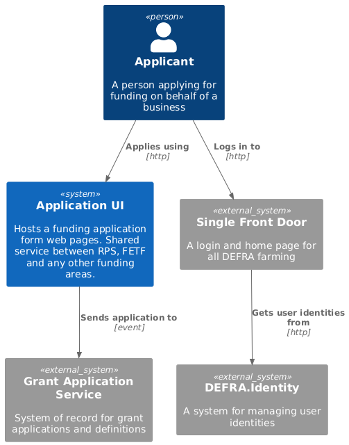

# Application Form UI

Hosts a funding application form web pages. Shared service between RPS, FETF and any other funding areas.

## Context diagram

## Capabilities

### Application form rendering

Generation of html pages on which are questions to help determine actions eligibility.

### Application form flow

## Data stored

| Name                     | Description                                     |
| ------------------------ | ----------------------------------------------- |
| Application form content | Questions with meta data about possible answers |
